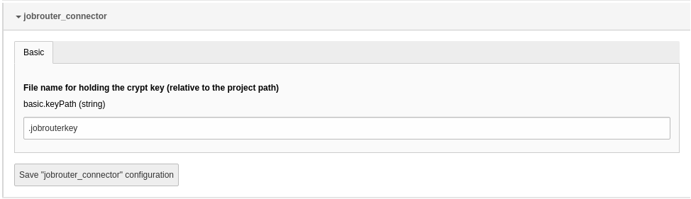

.. include:: _includes.rst.txt
.. highlight:: shell

.. _configuration:

=============
Configuration
=============

Target group: **Administrators**

.. _configuration-extension-configuration:

Extension configuration
=======================

To configure the extension, go to :guilabel:`Admin Tools` > :guilabel:`Settings`
> :guilabel:`Extension Configuration` and click on the :guilabel:`Configure
extension` button. Open the :guilabel:`jobrouter_connector` configuration:

   Extension configuration

basic.keyPath
-------------

The extension stores credentials in the database, the password will be
encrypted. With this configuration setting you define the path and name of the
key file relative to the project directory.

.. attention::

   The key should **never** be accessible via a browser. So do **not** put it in
   a folder like :file:`public` or :file:`htdocs`. If you have a standard TYPO3
   installation, the default value is fine.

.. _configuration-key-generation:

Key Generation
==============

An encryption key is required to encrypt and decrypt the password. The extension
provides a console command for creating a key. So log on to your server and go
to the project path. To generate the key, you need write permissions for this
path. Run the following command in the project directory for a composer
installation::

   vendor/bin/typo3 jobrouter:connector:generatekey

In a non-composer installation execute::

   php public/typo3/sysext/core/bin/typo3 jobrouter:connector:generatekey

Hopefully you will receive a successful response:

.. code-block:: text

   [OK] Key was generated and stored into "/your/project/path/.jobrouterkey"

.. admonition:: Some words about the key

   - The password of your connections is encrypted with this key. If it gets
     lost you will have to set the passwords again.

   - If you try to create another key with the same name, an error occurs. It
     is therefore not possible to accidentally overwrite the key.

   - It is a binary key, its value is generated randomly. So you don't have to
     type a passphrase or think about a key value yourself.

   - And again: **Never** place the key into a folder that is accessible via
     a browser.
