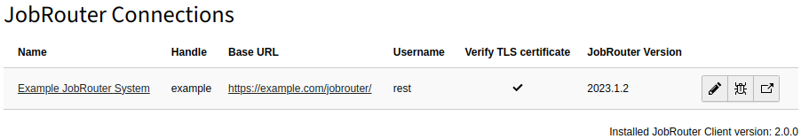

.. include:: _includes.txt

.. _usage:

=====
Usage
=====

Target group: **Integrators, Administrators**

.. _usage-module:

Module
======

The connections to JobRouter installations are managed in the module
:guilabel:`JobRouter` > :guilabel:`Connections`.

On your first visit after installing the extension you should see the following
screen:

.. figure:: _images/no-connections-found.png
   :alt: Initial Connections module screen

   Initial Connections module screen

.. note::

   If you see an error that the key file does not exist, :ref:`generate the key
   <configuration-key-generation>` first.

.. _usage-create-connection:

Create a Connection
===================

To create a new connection, click on the :guilabel:`+` button in the upper menu
bar, which displays a form:

.. figure:: _images/create-connection.png
   :alt: Create a connection

   Create a connection

The following fields are available:

:aspect:`Name`

   Use a name you recognise. This can be the name of the JobRouter installation
   or the purpose for which it is used. It is only descriptive.

:aspect:`Base URL`

   The base URL of the JobRouter installation.

:aspect:`Username`

   The username to login over the REST API.

:aspect:`Password`

   The password to be used. It will be stored encrypted in the database.

:aspect:`Enabled`

   In the :guilabel:`Access` tab you can enable or disable the connection.
   Disabled connections cannot be used.

.. tip::

   For security reasons, use a JobRouter user who only has the access rights
   required for the purpose. It is also possible to create two connections to
   the same JobRouter installation with different users.

.. caution::

   The JobRouter installation should be accessible only over TLS (https).

.. _usage-connection-list:

Connection List
===============

After creating one or more connections, you will see a list of connections when
calling the module:

   Connection list

If a connection is not enabled, this is indicated by the addition "(disabled)"
in the name.

There are three buttons available for each connection:

.. image:: _images/connection-buttons.png

- You can edit a connection with the pencil.
- Click on the bug icon to test a connection.
- The last icon is a link to the JobRouter installation.

.. _usage-delete-connection:

Delete a Connection
===================

To delete a connection, open the editing page of the connection. In the upper
menu bar you will find the :guilabel:`delete` button.

.. note::

   Currently, It is currently not checked during deletion whether this
   connection is used in other records.
