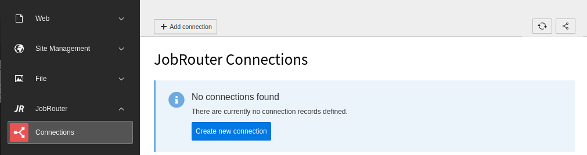
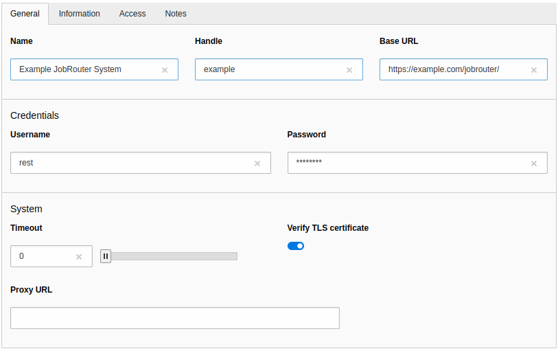

.. include:: _includes.rst.txt

.. _usage:

=====
Usage
=====

Target group: **Integrators, Administrators**

.. _usage-module:

Module
======

The connections to JobRouter® installations are managed in the backend module
:guilabel:`JobRouter` > :guilabel:`Connections`.

.. note::

   The module is only available in the live workspace.

On your first visit after installing the extension you should see the following
screen:

   Initial Connections module screen

.. note::

   If you get the error message that the key file does not exist,
   first :ref:`generate the key <configuration-key-generation>`.

.. _usage-create-connection:

Create a connection
===================

To create a new connection, click on the :guilabel:`+` button in the upper menu
bar, which displays a form:

   Create a connection

The following fields are available:

General
-------

Name
   Use a name you recognise. This can be the name of the JobRouter® installation
   or the purpose for which it is used. It is only descriptive.

Handle
   Enter a unique short handle. It can be used to create a connection
   programmatically and independent of the internal uid.

Base URL
   The base URL of the JobRouter® installation.

   .. caution::

      The JobRouter® installation should be accessible only over TLS (https), so
      that the credentials are transmitted encrypted.

Username
   The username to sign in over the REST API.

   .. tip::

      For security reasons, use a JobRouter® user who only has the access rights
      required for the purpose (technical user). It is also possible to create
      more than one connection to the same JobRouter® installation with
      different users.

Password
   The password to be used. It will be stored encrypted in the database.

Information
-----------

JobRouter Version
   The version of the JobRouter® installation. The version is automatically
   detected when a connection is established and is therefore read-only.

Access
------

Enabled
   In the :guilabel:`Access` tab you can enable or disable the connection.
   Disabled connections cannot be used.

Notes
-----

Description
   This is a descriptive field only. You can enter additional remarks for a
   connection.

.. _usage-connection-list:

Connection list
===============

After creating one or more connections, you will see a list of connections when
calling the module:

.. figure:: _images/connection-list.png
   :alt: Connection list

   Connection list

If a connection is not enabled, this is indicated by the addition "(disabled)"
in the name.

There are three buttons available for each connection:

.. image:: _images/connection-buttons.png

- You can edit a connection with the pencil.
- Click on the bug icon to test a connection. This will also update the
  JobRouter® version if necessary.
- The last icon is a link to the JobRouter® installation.

.. _usage-delete-connection:

Delete a connection
===================

To delete a connection, open the editing page of the connection. In the upper
menu bar you will find the :guilabel:`delete` button.

.. note::

   Currently, there is no check during deletion whether a connection is used
   in other records.
